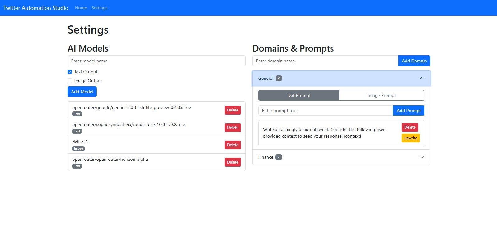
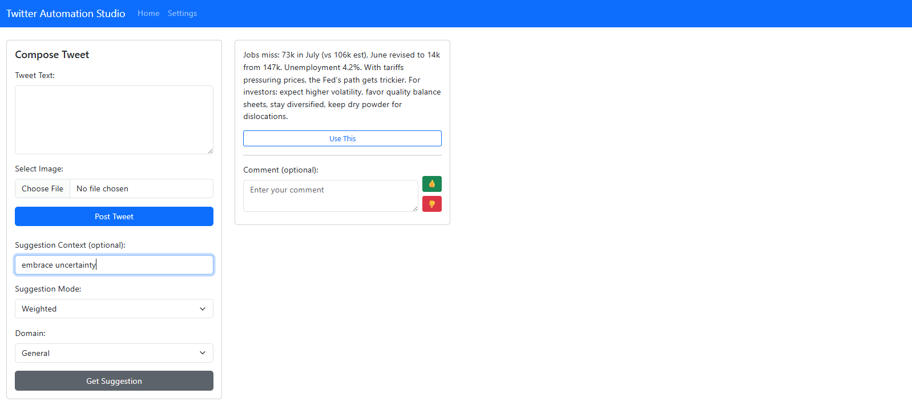
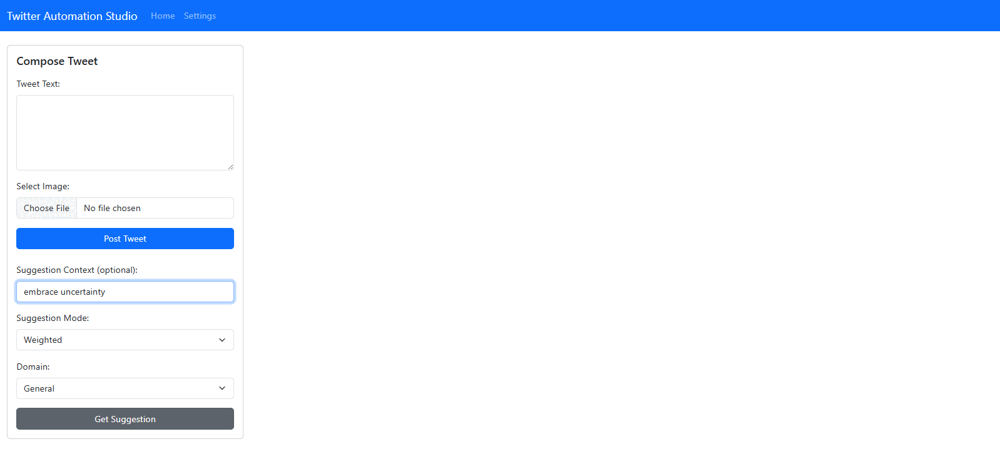

# Twitter/X Automation Studio

This project is aimed at creating a platform for automation-assisted social media marketing. The vision is that agentic workflows will supply ideas, images, research support, revisions, etc. to the user, who will then review the content and post it to their social media accounts.

## Setup

This demo repo uses the `uv` package manager to manage dependencies. If you don't already have `uv` installed, you can install it with the following curl command:

```bash
curl -LsSf https://astral.sh/uv/install.sh | sh
```

To verify install, use:

```bash
uv --version
```

Consult the [uv installation docs](https://astral.sh/uv/) for more detailed instructions and troubleshooting.

Once uv is installed on your system, clone this repo with:

```bash
git clone https://github.com/Promptly-Technologies-LLC/X_automation_studio
```

Then:

1. Navigate to the cloned directory with `cd X_automation_studio`.
2. Install dependencies with `uv sync`.
3. Copy the `example.env` file to `.env` with `cp example.env .env`.
4. Edit the `.env` file and add your API key, API secret, client token, client secret, access token, and access secret (for instructions on how to get these, see below).

## Configuration

### Getting an X API key and secret

Before you can run the app, you need to configure your Twitter API credentials. To do this, you need to [sign up for a Twitter/X developer account](https://developer.twitter.com/). Upon creating your account, you will receive an API key and an API secret. Save these in your `.env` file. 

### Getting an X access token and secret

You will also need to generate an access token and secret from your application's "Keys and Tokens" section in the developer dashboard. Save these to your `.env` file.

### Getting an LLM API key

You will also need to generate API keys for the model providers you want to use. To use the default models, you can generate API keys for [OpenAI](https://platform.openai.com/api-keys) for generating images, and [OpenRouter](https://openrouter.ai/settings/keys) for generating text. Save these to your `.env` file.

## Usage

To run the application, use:

```bash
uv run python main.py
```

This will start a FastAPI server on port 5000. You can then navigate to [http://127.0.0.1:5000](http://127.0.0.1:5000) in a web browser to view the app.

### Settings

Click the "Settings" button from the navigation bar to configure the app.



Here you can add models (prefix with `openrouter/` for OpenRouter models). You can also add domains (subject matter areas) and prompts within each domain for generating suggested tweets.

### Generating suggestions

The app consists of two forms: one for tweeting and one for generating tweet suggestions.

To generate a tweet suggestion, fill out the suggestions form. Provide some context for the tweet you want to generate, and then click "Generate Suggestion". The app will generate a tweet suggestion based on the context you provided:



You can then provide some feedback on the suggestion and click the thumbs up or thumbs down button. Your vote will be used to prioritize models and prompts that generate good suggestions, and deprioritize models and prompts that generate bad suggestions. Also, if you navigate back over to the settings page, you can click "Rewrite" on any prompt to have an LLM auto-rewrite the prompt, taking into account all your feedback on outputs from that prompt:


### Posting a tweet

Now, if we go back to the home page and generate a suggestion, we can see that the suggestion is now better:



If we want to use the suggestion, we can click "Use This", and it will be moved over into the tweeting form, where we can edit it to our liking and then click "Post Tweet".


To post a tweet, fill out the tweeting form. Supply some text and then click "Post Tweet". You will be redirected to Twitter to authenticate with your account. Once you authenticate, you will be redirected back to the app, which will display a link to your posted tweet.

